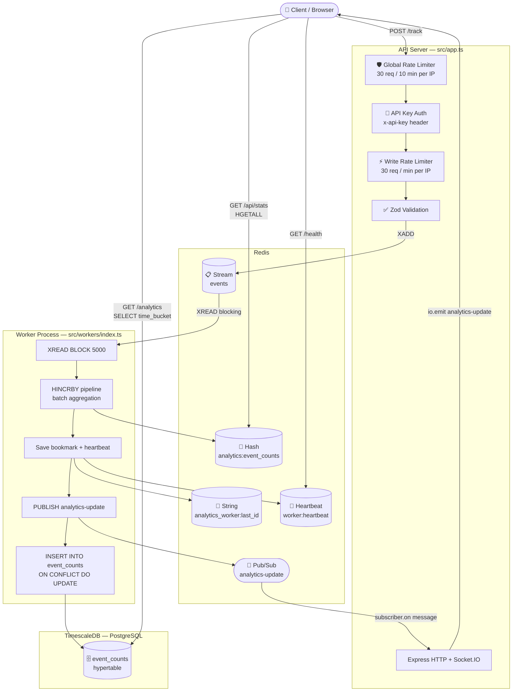

# High-Throughput Real-Time Analytics Pipeline

A production-grade data ingestion and processing pipeline built with Node.js, TypeScript, Redis Streams, and TimescaleDB. This project demonstrates how to build a scalable, event-driven system capable of high-throughput ingestion that handles traffic spikes without dropping events, processing them in real-time, and visualizing them on a live-updating dashboard.


---

## The Problem: Drinking from the Firehose

Modern applications generate a massive "firehose" of user events. A naive approach of writing every single event directly to a primary database will fail spectacularly under load, leading to system crashes and stale analytics.

This project solves the challenge of ingesting and processing this high-throughput data stream in a way that is **scalable**, **durable**, and **secure**, providing instant insights to the business.

---

## The Architecture: A Decoupled, Real-Time Pipeline



- **Ingestion API (Express.js):** A lightweight API guarded by API key authentication and two layers of rate limiting. Its only job is to validate events and push them into a Redis Stream.
- **Redis Streams (The "Conveyor Belt"):** A durable, ordered log that decouples the fast ingestion layer from the slower processing layer.
- **Stream Processing Worker:** A stateful background process that reads events in batches, tracks its position (bookmark), and never re-processes an event on restart.
- **TimescaleDB:** The permanent time-series data store. Events are rolled up into 1-minute buckets using `time_bucket` for efficient historical queries.
- **Real-Time Layer (Socket.IO):** The API server subscribes to Redis Pub/Sub and broadcasts live updates to all connected browsers via WebSockets.

---

## ✨ Key Features

- **Live Analytics Dashboard** — Real-time event counts via WebSockets, no page refresh needed.
- **High Throughput** — Redis Stream buffer absorbs traffic spikes without dropping events.
- **Data Durability** — Events survive worker restarts; the bookmark prevents re-processing.
- **API Key Authentication** — `POST /track` requires a valid `x-api-key` header.
- **Rate Limiting** — Global baseline limiter + tight per-endpoint write limiter.
- **Production Observability** — `/health` (503-aware deep check) and `/metrics` (Prometheus format).
- **Automated Test Suite** — 14 test files across unit, integration, and E2E layers; 80% coverage enforced.
- **Local CI Pipeline** — Husky pre-commit hooks run `typecheck` + `lint` on every commit.

---

## 🛠️ Tech Stack

| Layer | Technology |
|---|---|
| **Backend** | Node.js, TypeScript, Express.js v5 |
| **Real-Time** | Socket.IO |
| **Streaming** | Redis Streams (`ioredis`) |
| **Database** | TimescaleDB on PostgreSQL |
| **Validation** | Zod |
| **Security** | `express-rate-limit`, API Key middleware |
| **Testing** | Jest, `ts-jest`, Supertest, Docker Compose |
| **DevOps** | Docker, Docker Compose, Husky, GitHub Actions |

---

## 🚀 Getting Started

### Prerequisites

- Node.js v20+
- Docker and Docker Compose

### Setup & Run

1. **Clone the repository:**

    ```bash
    git clone https://github.com/thebigweal002/event-tracker.git
    cd event-tracker
    ```

2. **Set up Environment Variables:**

    ```bash
    cp .example.env .env
    ```

    Fill in your credentials:

    | Variable | Description |
    |---|---|
    | `REDIS_URL` | Redis connection string (`redis://...` or `rediss://...`) |
    | `DB_HOST` | PostgreSQL host |
    | `DB_NAME` | PostgreSQL database name |
    | `DB_USER` | PostgreSQL user |
    | `DB_PASSWORD` | PostgreSQL password |
    | `API_KEYS` | Comma-separated valid API keys for `POST /track` |

3. **Start with Docker Compose:**

    ```bash
    docker-compose up --build
    ```

### Local Development (Without Docker)

Run the two processes in separate terminals:

```bash
# Terminal 1 — API server (auto-restarts on file changes)
npm run dev

# Terminal 2 — Background stream worker
npm run dev:worker
```

---

## 🕹️ Usage & Testing

### 1. View the Live Dashboard

Navigate to **`http://localhost:5000/dashboard`** in your browser.

### 2. Track an Event

`POST /track` requires an `x-api-key` header matching a key in your `API_KEYS` env var:

```bash
curl -X POST http://localhost:5000/track \
  -H "Content-Type: application/json" \
  -H "x-api-key: your-api-key" \
  -d '{"eventName": "page_view", "url": "/home", "userId": "u-123"}'
```

To fire a burst of events at once, use the provided shell script:

```bash
bash ./test_track.sh
```

### 3. Monitor System Health

```bash
# Deep health check — Postgres, Redis, Worker liveness & lag
curl http://localhost:5000/health

# Prometheus metrics exposition
curl http://localhost:5000/metrics
```

### 4. Run the Test Suite

Ensure **Docker Desktop** is running — the suite spins up isolated containers automatically.

```bash
# Run all tests (unit + integration + e2e)
npm test

# Run with coverage report (80% threshold enforced in CI)
npm run test:coverage

# Run a single file
npx jest tests/unit/schema.test.ts
```

### 5. Code Quality

```bash
npm run typecheck    # TypeScript type-check (no emit)
npm run lint         # ESLint
npm run format       # Prettier auto-format
```

Husky pre-commit hooks enforce `typecheck` + `lint` automatically on every commit.

---

## 🔄 CI/CD

Two GitHub Actions workflows run on push and pull request to `main`:

| Workflow | File | What it does |
|---|---|---|
| **Node.js CI** | `.github/workflows/ci.yml` | `npm ci` → `npm test` → `eslint` |
| **Tests** | `.github/workflows/test.yml` | `npm run test:coverage` with Docker Compose (80% gate) |

---

## 🗺️ Future Improvements

- **Consumer Groups:** Transition from manual bookmarks to `XREADGROUP`. This is the most natural next step for horizontal scaling, allowing multiple worker instances to cooperatively share the stream. Because Redis tracks the offset within the group, you can scale workers up or down without affecting the "bookmark" logic or risking double-processing.
- **Independent Consumers:** Add a second consumer group for unrelated tasks (e.g., a "Fraud Detection Worker"). This allows multiple independent systems to process the same event stream at their own pace without interfering with each other's progress.
- **Scale to Kafka:** For planet-scale requirements involving multi-region replication or massive data retention, the Redis Stream layer can be swapped for Apache Kafka while maintaining the same architectural patterns.